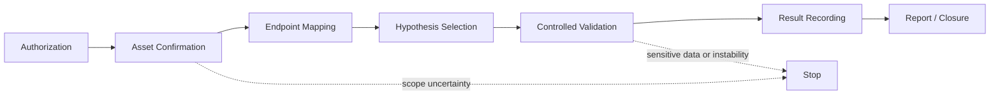
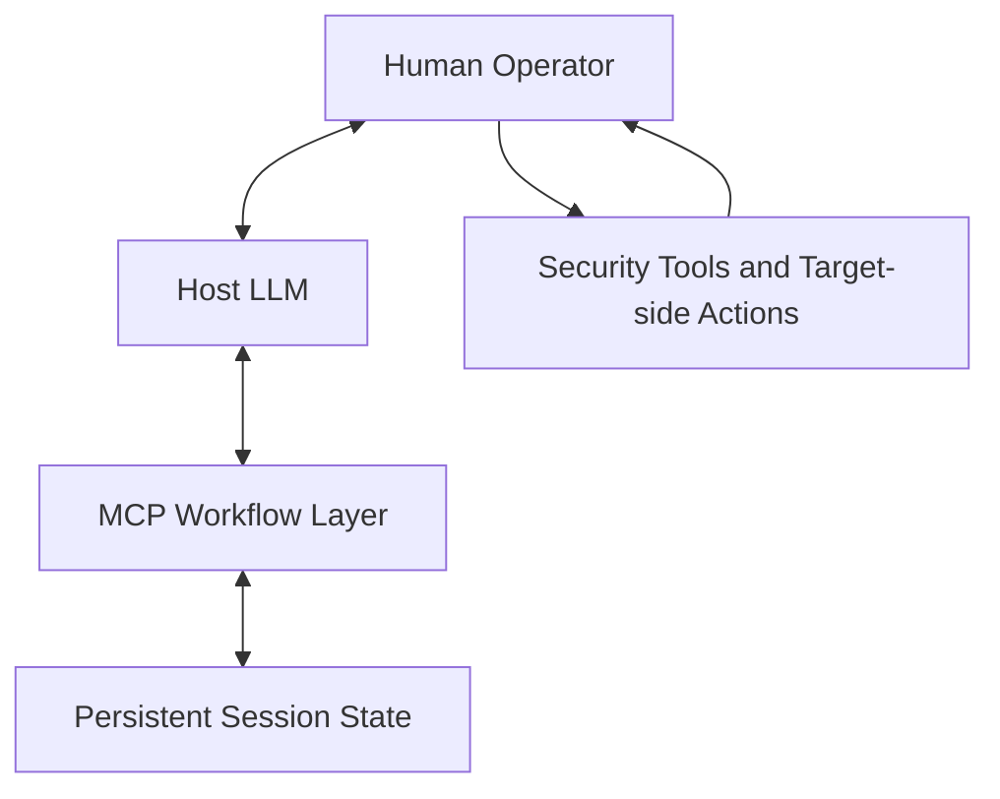

# Human-in-the-loop MCP Security Workflow

> A stateful MCP workflow for authorized Web/API security analysis, combining LLM-assisted reasoning, human-controlled validation and persistent workflow state.

这是一个面向授权 Web/API 安全分析的 Human-in-the-loop MCP Agent Workflow。项目本体是安全 Workflow：它将一次有授权边界、需要人工判断的安全分析，组织为可持续推进、可记录、可停止的多阶段流程。

## Overview

安全分析不是单一步骤任务。授权范围、资产确认、接口映射、验证历史和停止原因都需要在长流程中保持一致。本项目使用 MCP 保存这些结构化状态，并让不同角色在明确边界内协同：

- **LLM**：分析当前状态、组织上下文、提出下一步建议。
- **MCP Workflow Layer**：持久化 session、维护阶段状态，并实现部分 stage gating。
- **Human Operator**：执行真实目标请求、高风险验证、人工重放和最终影响确认。
- **Security Tools**：提供证据或候选线索。

`tool output != confirmed finding`。工具输出只能进入 Candidate 路径，不能自动成为最终安全结论。

## Why This Workflow

安全场景天然需要 Human-in-the-loop：操作必须在明确授权范围内，高风险动作不能完全交给模型，工具结果可能误报，多阶段任务容易发生状态漂移，而最终结论需要人工验证。

因此，这个安全 Workflow 同时展示了 Agent Engineering 中常见的工程问题：

- multi-stage workflow orchestration；
- persistent state management；
- Human-in-the-loop；
- stage gating；
- tool-use boundaries；
- evidence verification；
- stop conditions。

这些能力不是把安全项目包装成通用 Agent 平台，而是安全分析这一真实业务场景本身对流程设计提出的要求。

## End-to-End Workflow

1. **Authorization**：记录精确范围与授权依据。
2. **Asset Confirmation**：确认资产属于授权范围后再进入接口建图。
3. **Endpoint Mapping**：以结构化状态记录关键接口及预期授权行为。
4. **Hypothesis Selection**：基于已映射接口选择一个待验证方向。
5. **Controlled Validation**：由人工执行基线与受控变化的真实目标操作。
6. **Result Recording**：区分 Candidate 和经人工确认的结论。
7. **Report / Closure**：保留最小化、脱敏的总结并关闭会话。

流程不包含自动扫描、自动利用或自动攻击链。

## Runtime Implementation

当前运行时代码实现了完整 Workflow 规范中的一部分可确定性门槛：

- JSON session persistence；
- 创建 session 时的 authorization checks；
- 接口记录前必须有 confirmed 且 in-scope 的资产；
- 至少记录 5 条接口后才能选择 hypothesis；
- 每个 session 只能选择一个 hypothesis；
- 每个 hypothesis 最多 2 条 validation；
- scanner lead 固定记录为 Candidate；
- Confirmed 需要 `manual_replay_confirmed` 和具体 impact description；
- 对敏感非本人数据、服务异常和显式停止执行部分 stop conditions。

The runtime implements only part of the full workflow specification. 它不是完整 policy engine，也没有实现完整的 action-level approval enforcement、自动 re-planning、自动 data governance 或自动 closure engine。

## What This Demonstrates for Agent Engineering

这个项目关注安全 Workflow，但其核心挑战与 Agent / MCP 工程直接相关：长流程任务如何保持状态，阶段如何以确定性规则推进，模型建议如何与人工批准协作，工具线索如何被约束为候选而非结论，以及何时应停止而不是继续扩展操作。

安全场景本身要求这些能力，因此该设计具有自然的 Agent Engineering 迁移价值：它不是抽象的通用平台，而是一个在高风险流程中实践状态管理、工作流编排、结构化记录、验证边界和部分运行时约束的项目。

## Human-in-the-loop

Human-in-the-loop 在这里是业务安全要求，而不是术语堆砌。

- 模型不直接决定最终漏洞结论。
- 扫描或安全工具输出只作为 Candidate。
- Confirmed 需要人工重放和具体影响确认。
- 高风险的真实目标操作保留给人工。

代码会保存调用方提供的人工确认状态，并把它作为流程门槛；它不会独立证明重放已发生，也不会替代人工的授权与影响判断。

## Workflow Specification vs Runtime

| Capability | Specification | Runtime |
| --- | --- | --- |
| Authorization | 文档定义精确范围、授权依据与人工确认 | 代码检查确认标记及基础输入；不独立验证授权有效性 |
| Stage gating | 文档定义按流程推进 | 代码部分实现资产确认、5 接口门槛、单一 hypothesis 和 validation 上限 |
| Candidate / Confirmed | 文档定义工具线索与最终结论的区分 | 代码将 scanner lead 记为 Candidate；Confirmed 需要人工重放标记和影响描述 |
| Action-level approval | 文档要求人工保留高风险操作 | 尚未完整 runtime enforcement |
| Tool-risk policy | 文档和示例策略定义工具边界 | 主要是 specification-level，未完整 runtime enforcement |
| Stop conditions | 文档定义边界、敏感数据和异常时停止 | 代码部分实现敏感非本人数据、服务异常、边界停止和强制停止 |
| Audit records | 文档要求最小化、脱敏记录 | 代码以 JSON 保存结构化 session 状态；不是防篡改审计系统 |
| Data governance | 文档要求脱敏与最小必要记录 | 尚未完整 runtime enforcement |
| Closure | 文档定义最小化 recap 与关闭 | 代码可保存关闭结果；不是自动 closure engine |

## Architecture

Security Tools 由人工使用，结果以脱敏的结构化摘要带回 Workflow。MCP adapter 不直接发送网络请求、启动扫描器、执行 shell 命令或保存原始凭据。

## Focused Offline Tests

仓库包含 3 个 focused offline tests，覆盖授权拒绝、五接口与人工重放门槛，以及敏感非本人数据触发停止。测试使用临时 session 目录，不访问网络目标。

## Attribution

- PentestGPT is a third-party open-source project.
- FastMCP / MCP Python SDK are third-party frameworks.
- OWASP WSTG is a third-party reference.
- This repository focuses on my local security workflow design, MCP state adaptation and workflow constraints.

本仓库不包含、也不声称本人开发 PentestGPT；它不包含 PentestGPT 上游源码或完整 OWASP WSTG 副本。

## Limitations

- No autonomous scanning.
- No automatic exploitation.
- Target-side operations remain human-controlled.
- Action-level approval is not fully runtime-enforced.
- Tool policy is mostly specification-level.
- JSON persistence has limited concurrency guarantees.
- Human confirmation partly relies on caller-provided state.
- This is not a complete autonomous security Agent.

## License

Original material in this repository is available under the [MIT License](LICENSE). Third-party software remains subject to its own license terms.
