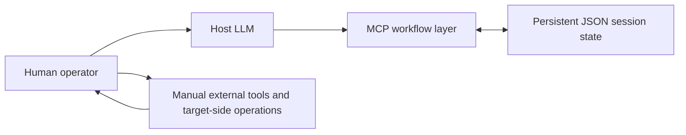
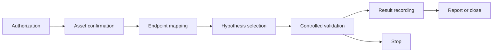

# MCP Human-in-the-loop Workflow

A stateful MCP workflow for controlled Agent execution with stage gating and human confirmation.

## Overview

This repository demonstrates a local MCP adaptation for structured, authorized security-analysis workflows. A host LLM assists with analysis and decision support; the MCP layer persists session state and enforces a small set of workflow gates. Any target-side browsing, request, scan, or validation is performed manually by the operator.

It is not an autonomous pentest agent, scanner, or exploitation framework.

## My contribution

- Local MCP adaptation
- Persistent JSON session state
- Stage gating
- Human-in-the-loop workflow
- Candidate / Confirmed result separation
- Authorization and stop rules
- Offline workflow tests
- Workflow policies and reporting templates

## Architecture



The adapter records redacted workflow state. It does not run shell commands, send network requests, start scanners, or store raw credentials.

## Workflow



- A session requires an explicit authorization confirmation, exact scope, and authorization basis.
- An asset must be confirmed and in scope before endpoints are recorded.
- At least five key endpoints are required before hypothesis selection.
- A session accepts one hypothesis and at most two validation records for it.
- A scanner lead is always a Candidate and requires manual replay before it can support a conclusion.
- A Confirmed conclusion requires a caller-supplied manual-replay flag and a concrete actual-impact statement.
- Non-owned sensitive data, service instability, or a boundary stop moves the session to a stopped state.

## Project structure

```text
src/                 MCP adapter
tests/               Offline workflow tests
workflow/            Non-executable policy and review template
docs/                Architecture and workflow details
examples/            Fully synthetic session example
SECURITY_REVIEW.md   Inclusion and exclusion review
```

## Running locally

The adapter retains integration imports from the separately installed PentestGPT project, but its state-management workflow and offline tests run without vendoring PentestGPT. This repository deliberately does not include PentestGPT or its source tree.

1. Install a supported Python runtime (`>=3.12,<4.0`).
2. Install this project and its MCP dependency:

   ```powershell
   pip install -e .
   ```

3. Run the offline tests:

   ```powershell
   python -m unittest tests.test_mcp_workflow -v
   ```

4. Start the local MCP server over stdio:

   ```powershell
   python src/pentestgpt_mcp.py
   ```

For native PentestGPT model discovery, prompt integration, or the CLI-command helper, install PentestGPT separately according to its upstream instructions so `pentestgpt_legacy` is importable.

## Tests

`tests/test_mcp_workflow.py` covers authorization rejection, the five-endpoint and manual-replay gates, Candidate handling for scanner leads, Confirmed-report readiness, and forced stopping for non-owned sensitive data. The tests use a temporary session directory and do not access a network target.

## Limitations

- Target-side network operations are manual.
- There is no autonomous scanning or automatic exploitation.
- Human confirmation is partly represented by caller-supplied state.
- Session persistence uses JSON rather than a database.
- The policy documents explain intended operating practice; they are not a complete runtime policy engine.
- The native CLI command helper reflects a Windows virtual-environment layout and requires a separately installed PentestGPT environment.

## Attribution

- PentestGPT is a third-party open-source project. See the [upstream project](https://github.com/GreyDGL/PentestGPT).
- MCP Python SDK / FastMCP are third-party frameworks.
- This repository focuses on my local adaptation and workflow design; it does not include or claim authorship of PentestGPT.

## License

Original material in this repository is available under the [MIT License](LICENSE). Third-party software remains subject to its own license terms.
