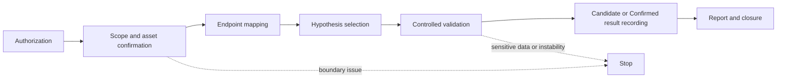
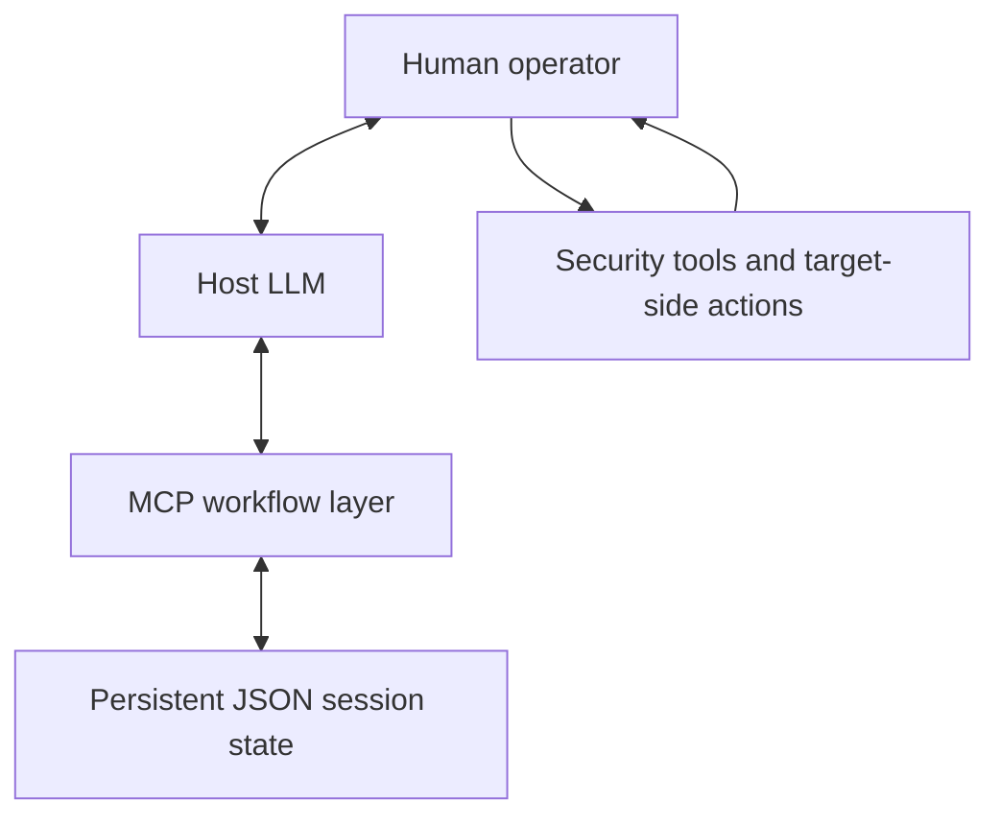

# Human-in-the-loop MCP Security Workflow

> A stateful MCP workflow for authorized Web/API security analysis, combining LLM-assisted reasoning, human-controlled validation, and persistent workflow state.

中文定位：面向授权 Web/API 安全分析的 Human-in-the-loop MCP Agent 工作流。

## Overview

This is a security-workflow project, not an autonomous testing system. It shows how a local MCP layer preserves the state of an authorized security-analysis engagement, controls selected stage transitions, separates tool leads from human conclusions, and records stop conditions. A host LLM helps organize information and suggest a next step; target-side work remains under human control.

## Why This Workflow

Authorized Web/API analysis is a long-running, high-risk workflow. Context such as authorization, scope, mapped interfaces, validation history, and a reason to stop must survive across steps. The workflow therefore gives each role a clear boundary:

- The **LLM** reads the recorded state, helps analyze it, and suggests the next low-impact step.
- The **MCP workflow layer** persists session state, tracks the current stage, and enforces selected validation gates.
- The **human operator** performs real target interaction, high-risk actions, manual replay, and final impact confirmation.
- **Security tools** supply evidence or candidate leads. Their output is not a final conclusion.

## End-to-End Workflow



The detailed operating path is in [docs/end-to-end-workflow.md](docs/end-to-end-workflow.md). The synthetic example uses `example.com` only and contains no target traffic or exploit payload.

## Architecture



Security tools are operated by the human and their redacted findings are brought back into the workflow. The adapter itself does not send network requests, start scanners, run shell commands, or store raw credentials.

## Runtime Implementation

The adapter in [src/pentestgpt_mcp.py](src/pentestgpt_mcp.py) implements part of the workflow specification:

- JSON session persistence;
- explicit authorization confirmation and an exact scope/basis check at session creation;
- a confirmed in-scope asset before endpoint mapping;
- a five-endpoint gate before hypothesis selection;
- one hypothesis per session and at most two validation records for it;
- scanner leads recorded as Candidate only;
- manual replay plus a concrete impact statement required for Confirmed;
- stop transitions for sensitive non-owned data, service instability, and an explicit boundary stop.

The code does not claim to runtime-enforce every operational rule. Read [docs/architecture.md](docs/architecture.md) for the state boundary and [docs/workflow.md](docs/workflow.md) for the concrete gates.

## Workflow Specification

The documents in [workflow/](workflow/) guide the parts that require operator judgment:

- [handbook.md](workflow/handbook.md) explains the workflow and role handoffs.
- [sop.md](workflow/sop.md) gives the human operating sequence.
- [governance.md](workflow/governance.md) records approval, evidence, and stop expectations.
- [policies/tool-policy.example.json](policies/tool-policy.example.json) is a non-target-specific policy example.
- [templates/](templates/) contains generic engagement, interface-inventory, and validation-record forms.

These documents complement the runtime gates; they are not a complete policy engine.

## Human-in-the-loop

The workflow deliberately reserves high-risk behavior for the operator. A tool result can be useful evidence, but it becomes only a Candidate in the persisted state. A result can be marked Confirmed only after a human records a manual replay and a specific impact statement. The `manual_replay_confirmed` value is still caller-provided workflow evidence, not independent proof generated by the code.

## Tests

Run the focused offline tests from the repository root:

```powershell
python -m unittest tests.test_mcp_workflow -v
```

The three tests use a temporary session directory and no network target. They cover authorization rejection; the five-endpoint, Candidate, and manual-replay gates; and the stop transition for synthetic non-owned sensitive data.

Latest local run: `python -m unittest tests.test_mcp_workflow -v` — **3 tests passed**.

## Example Workflow

[examples/example-session.json](examples/example-session.json) is a fully synthetic, closed session for `example.com`: authorized session, confirmed asset, five mapped interfaces, one hypothesis, a Candidate lead, manual replay, a Confirmed validation, and closure. It is a state-shape example only; it neither contacts a target nor contains a real vulnerability payload.

## Limitations

- No autonomous scanning or automatic exploitation is implemented.
- Target-side operations are manual.
- Tool policy is not fully runtime-enforced; action-level approval is mainly specification-level.
- JSON persistence has limited concurrency guarantees.
- Human confirmation partly relies on caller-provided state.
- PentestGPT-specific model discovery, prompt integration, and CLI-command validation require a separate installation.

## Attribution

PentestGPT is a third-party open-source project. FastMCP and the MCP Python SDK are third-party frameworks. This repository contains my local workflow design, MCP adaptation, documentation, and focused workflow tests; it does not include or claim authorship of PentestGPT or its upstream source code. See the [PentestGPT upstream project](https://github.com/GreyDGL/PentestGPT).

## License

Original material in this repository is available under the [MIT License](LICENSE). Third-party software remains subject to its own license terms.
