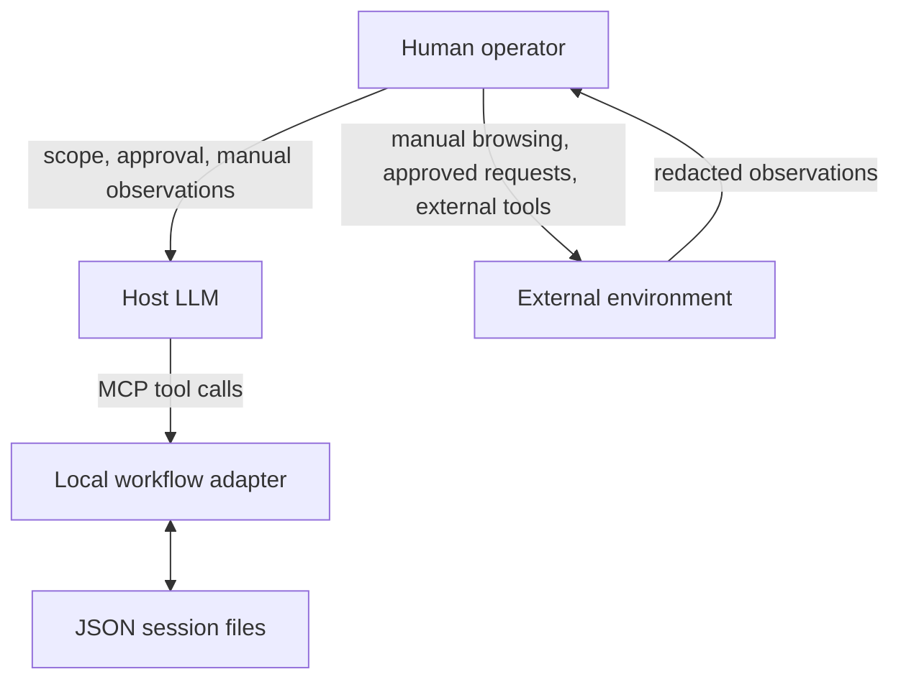

# Architecture

## Purpose

The adapter is a local state-management layer between a host LLM and a human operator. It gives the host a persisted, structured view of authorization, mapping, hypotheses, validations, and stop state without executing target-side actions.

## Runtime responsibilities

The adapter creates JSON files in `mcp-sessions/` at runtime. It records structured summaries and workflow metadata. It performs no scanner launch, shell execution, network request, or credential collection.

PentestGPT is not included. When separately installed, its `pentestgpt_legacy` package provides version, model-registry, and prompt integration. Without it, the stateful workflow remains available, while native model discovery and CLI-command validation are unavailable. The MCP Python SDK/FastMCP exposes the local functions as MCP tools.

## State model

A session records its authorization context, assets, endpoints, scanner leads, one selected hypothesis, validations, workflow steps, phase, status, and stop reason. Session IDs are short hexadecimal identifiers and the JSON store is local-only by default through `.gitignore`.

The externally supplied `manual_replay_confirmed` value represents a human assertion. It is a workflow gate, not independent proof that a replay occurred.
