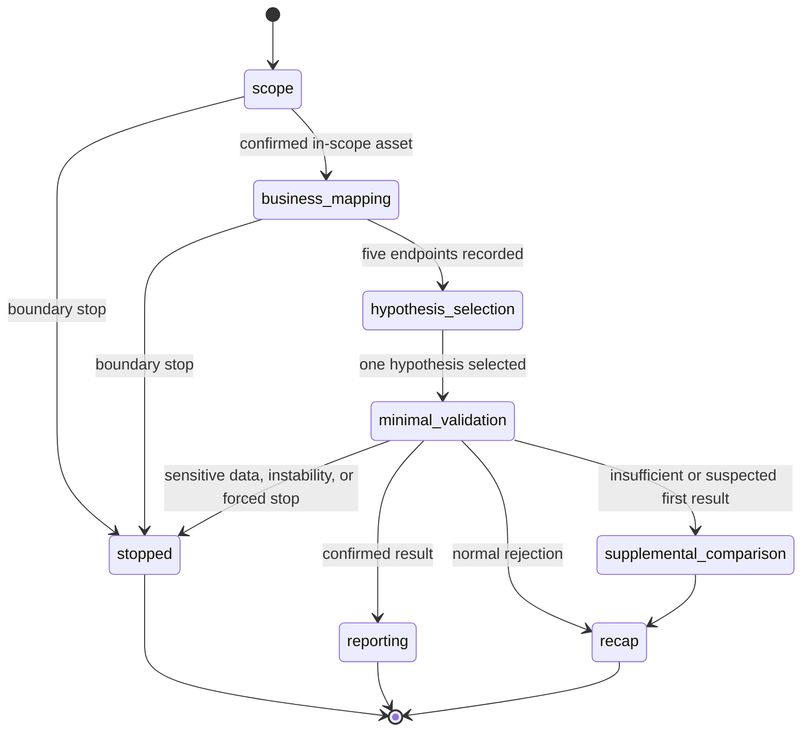

# Runtime workflow behavior

## State progression

## Gates

1. `create_authorized_session` rejects a session unless the caller provides explicit authorization confirmation, a sufficiently specific task description, exact target scope, and authorization basis.
2. `record_asset` allows a confirmed asset only when it is explicitly in scope.
3. `record_endpoint` requires a confirmed in-scope asset and non-empty mapping fields.
4. `select_hypothesis` requires at least five recorded endpoints and permits only one hypothesis in a session.
5. `record_validation` permits only two records for the selected hypothesis: a baseline and, where the first result is insufficient or suspected, one supplemental comparison.

## Candidate and Confirmed

`record_scanner_lead` assigns `candidate_manual_replay_required`; a scanner lead does not confirm a vulnerability.

`record_validation` accepts a `confirmed` conclusion only when `manual_replay_confirmed` is true and `actual_impact` contains a concrete statement. These values are retained as caller-supplied workflow evidence, not as automatically verified facts.

## Stop conditions

`record_step` can stop a session when the caller declares a boundary stop. `record_validation` forces a stop if it records non-owned sensitive data, service instability, or a forced-stop conclusion. Once stopped, the adapter rejects further active workflow records and returns a redacted-recap instruction.

## Operational boundary

The code persists workflow state but does not enforce every operational rule described in the workflow specification. Operators remain responsible for authorization, target-side action, evidence handling, and applicable policy requirements.
